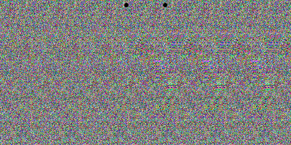

# stereograms

This project allows you to generate **stereograms** — optical illusions that reveal a hidden 3D image when viewed with the correct eye focus — from grayscale depth maps. You can use the **command-line script** or a simple **graphical interface** built with Tkinter.

## Features

- Convert a grayscale depth map into a stereogram.
- Add guide dots to help with viewing the 3D effect.
- Interactive GUI to:
  - Upload a depth map image.
  - Configure pattern width and depth shift.
  - Preview and save the final stereogram.

## What is a Stereogram?

A stereogram encodes depth information into a repeating pattern such that, when viewed properly, a 3D shape appears. This project uses grayscale depth maps, where white represents "closer" areas and black is "farther."

---

## Requirements

- Python 3.8+
- Pillow
- NumPy
- Tkinter (usually included with Python)

You can install the dependencies using:

```bash
pip install -r requirements.txt
```

---

## How to Use

### 1. **From the Command Line**

```bash
python stereograms.py
```

Make sure a file named `depth_map.png` exists in the same directory. The script will generate a stereogram and save it as `stereogram.png`.

You can customize:
- `depth_map_path`: path to the input depth map
- `output_path`: output file name
- `width`, `height`: image dimensions
- `pattern_width`: base pattern width
- `max_shift`: maximum depth shift for close areas

---

### 2. **With the GUI**

```bash
python app.py
```

- Click **Upload Depth Map** and choose a grayscale image.
- Set **Pattern Width** and **Max Depth Shift**.
- Click **Generate Stereogram** to preview the result.
- Click **Save Image** to save it as PNG.

---

## Example

  
<sub>*Cross your eyes slightly to reveal the hidden shape!*</sub>

---

## License

This project is open source under the [MIT License](LICENSE).